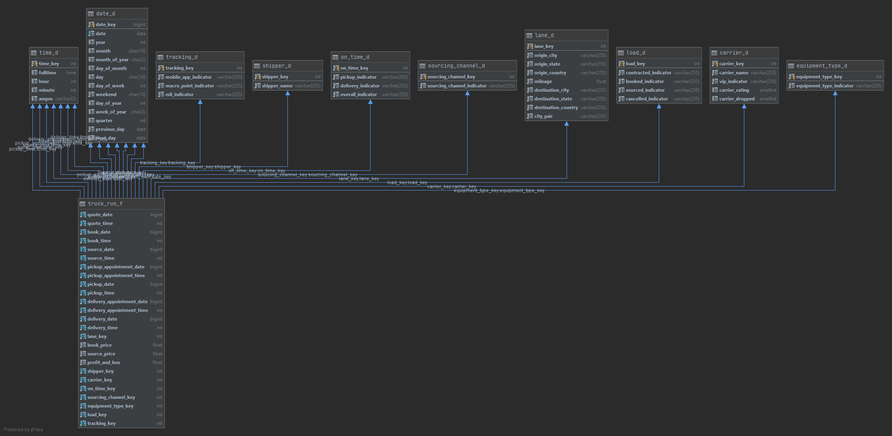
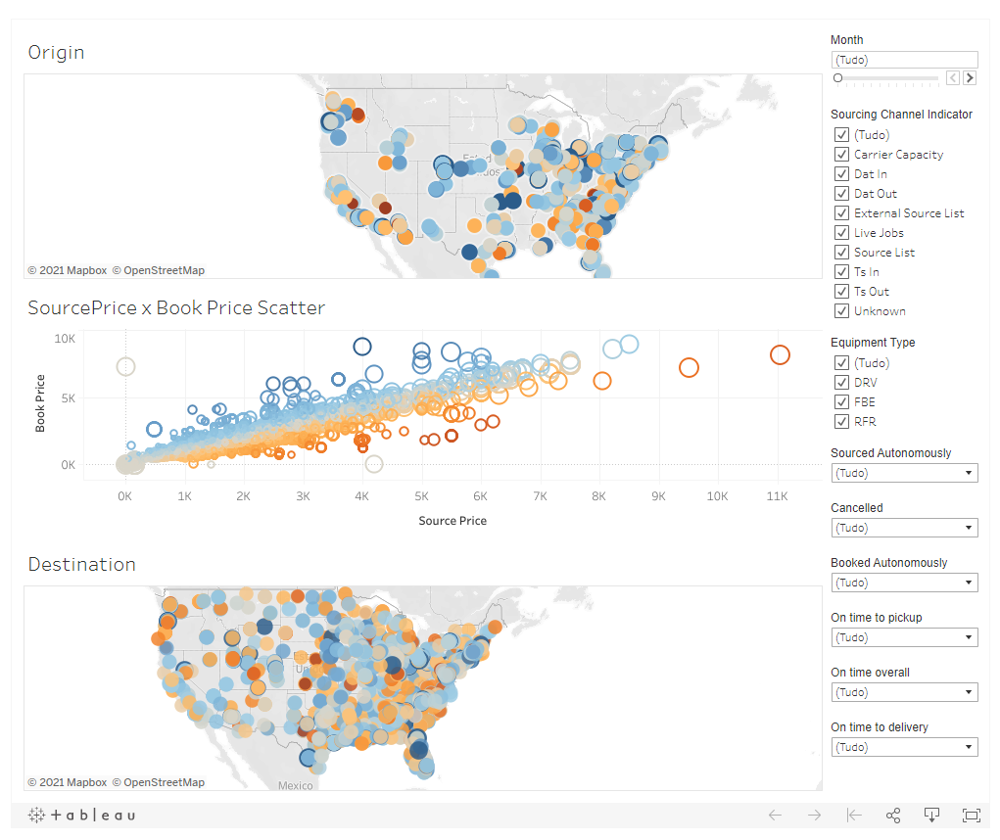

# Logistics Datawarehouse
Provides the creation of a datawarehouse and the extraction of sample a CSV file to populate it. <br>
The result is a self-service data-analysis to slice and dice freely combining different dimensions. <br>
A visualization of the data can be found in this dashboard: https://public.tableau.com/profile/gabriel3199#!/vizhome/logistics-datawarehouse/Dashboard1


1 - [Get started](#Get Started)

2 - [The model](#The model)

3 - [Visualizing](#Visualizing)

## Get Started
First you should have a MySQL instance and python 3.8+. <br>
Then, the easiest way to run the project is: <br>
1 - Clone the repository and cd onto it <br>
2 - Create the database using the script at /scripts/create_database.sql <br>
3 - Install the requirements using pip <br>
    `pip install -r requirements.txt` <br>
4 - Open a terminal and export the environment variables to access the MySQL instance <br>
```
export DWH_HOST=localhost
export DWH_USER=root
export DWH_PASSWORD=password
export DWH_DATABASE=logistics
```
They are, respectively, the host, the user and password to access and the database name. 
If you're on a Windows CLI, change export to `set`. <br>
4 - Populate the database <br>
    `python populate.py` <br>
5 - Happy analysis!
```sql
SELECT  ld.city_pair, COUNT(*) as delays FROM truck_run_f
INNER JOIN lane_d ld on truck_run_f.lane_key = ld.lane_key
INNER JOIN on_time_d otd on truck_run_f.on_time_key = otd.on_time_key
where otd.delivery_indicator='Carrier Not On Time To Delivery'
GROUP BY ld.city_pair
ORDER BY delays DESC
``` 
The above query gets the most delayed to delivery routes.
  
## The model

The idea of the model is to model the process of contracting a truck to carry your shipment. We want to be able to analyze at the level of individual events.
It's meant to be a simple star schema to model the fact `truck_run`. The measures are the
book price, source price and profit. All the other variables present in the original data are transformed
to dimensions.
The quote, book, pickup, delivery and appointments are roleplayed to the dimensions date and time. Date and time are
split into different dimensions. <br>
The lane dimension holds both the origin and destination. The mileage is also put in this dimension because analyzing
the data we saw that it only differs between different lanes. <br>
Equipment and sourcing are two normal predictable dimensions, populated before the ETL. <br>
Shipper and carrier are also normal dimensions but populated in the ETL to map new or existing entities. <br>
The Load, On Time and Tracking are junk dimensions to map boolean values. They have finite possibilities but are only populated when needed.
The tracking, for example, has only one possible combination, which is all False.

Using this modeling we can get valuable information about how the metrics change slicing and dicing as many dimension we may want.

## Visualizing
The below dashboard can be fulled analyzed interactively at: https://public.tableau.com/profile/gabriel3199#!/vizhome/logistics-datawarehouse/Dashboard1 

The scatter in the middle changes its color based on the profit, and its size on the mileage. <br> The points in
the maps also respects this rule. <br> 
We see a clear relationship between book x source's price and the profit. <br>
The filters in the right gives the ability to slice and dice the data, we can change the month, see cancelled loads, automations,
filter by delays, equipment type and source channel. <br>
Filtering the date we can know: if we see more blues we are getting the most profitable runs.
The model is very versatile and can be combined/visualized in different ways to get more insights. There are numerous possibilities.
 